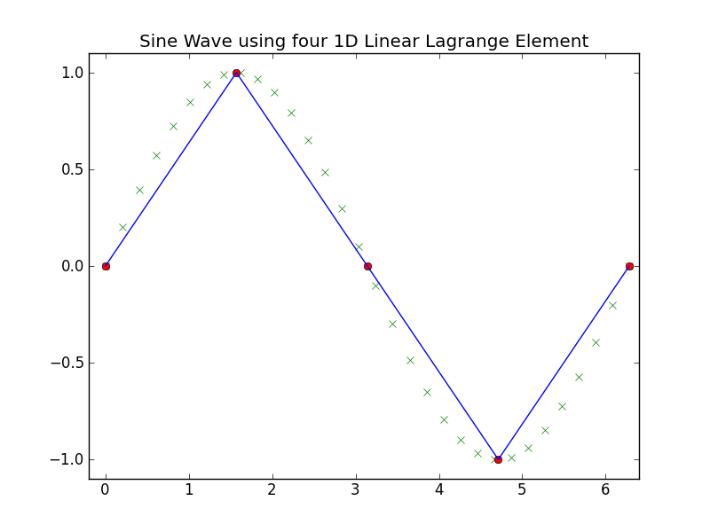
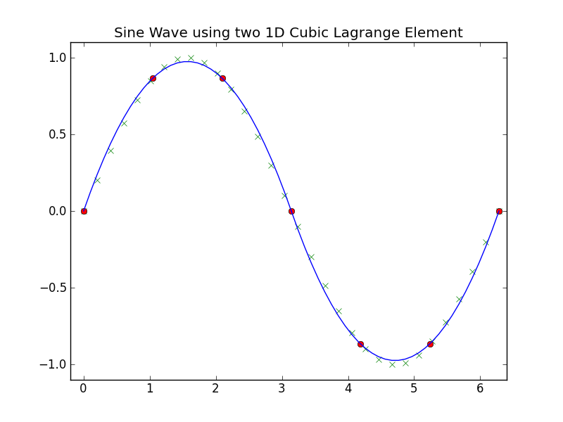
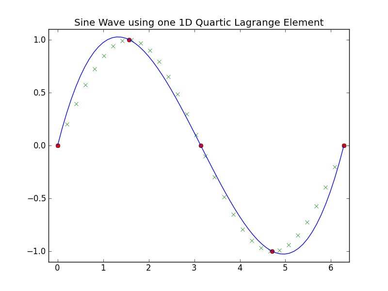

********
Examples
********

.. toctree::
   :maxdepth: 2
  
Description

===========
1D Elements
===========

---------------
Linear Lagrange
---------------

Four 1D linear lagrange element,

.. literalinclude:: ../examples/example_1d_linear.py
    :start-after: # sphinx tag start
    :end-before: # sphinx tag end

    
------------------
Quadratic Lagrange
------------------

Two 1D quadratic lagrange element,

.. literalinclude:: ../examples/example_1d_quadratic.py
    :start-after: # sphinx tag start
    :end-before: # sphinx tag end

.. figure::  ./images/example_1d_quadratic.png
    :align:   center
    :width: 400px

--------------
Cubic Lagrange
--------------

Two 1D cubic lagrange element,

.. literalinclude:: ../examples/example_1d_cubic.py
    :start-after: # sphinx tag start
    :end-before: # sphinx tag end

----------------
Quartic Lagrange
----------------

One 1D quartic lagrange element,

.. literalinclude:: ../examples/example_1d_quartic.py
    :start-after: # sphinx tag start
    :end-before: # sphinx tag end

