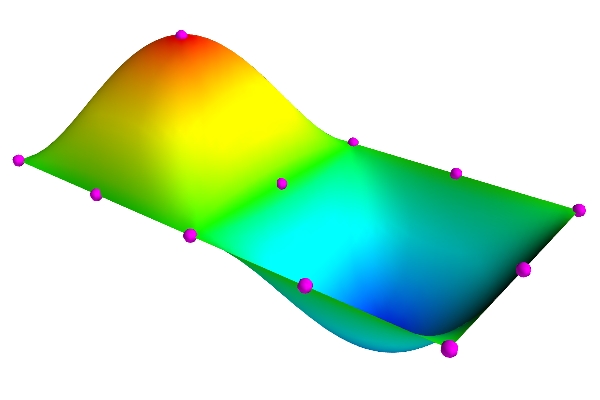

*******
Meshing
*******

.. toctree::
   :maxdepth: 2

A mesh is a convinient way to describe field values over a domain.
Examples of fields include temperature fields, velocity fields, strain
fields, and geometric fields such as the the line path a string might
take or the surface or volume of an object.

A mesh typically consists of field values, a topography over which they
they are sampled and the basis functions used to interpolate the fields
over the topography. In morphic nodes define field values and elements
define the topography and basis functions.

In this section, we will introduce:
    - creating mesh
    - plotting a mesh
    - saving and loading a mesh
    - nodes
    - elements
    
We will do this through examples, more details on the mesh, nodes and 
elements can be found in the API (**LINK**).

.. warning::
    
    Morphic has been developed for 1D and 2D meshes. Support for higher
    order meshes are intended however it is not complete.


===============
Creating a Mesh
===============

Before we can create a mesh we need to import the Morphic module:

.. code-block:: python
    
    import morphic

Now we can create a mesh by:

.. literalinclude:: ../examples/create_mesh.py
    :start-after: # Create mesh
    :end-before: # Add nodes

The mesh is created from two biquadratic elements which joined along one
edge. For this we add 15 nodes in a regular 5x3 grid where the z-value
of the middle node of elements 1 and 2 are set to 1 and -1.

The command to add a standard node is:

.. code-block:: python
    
    mesh.add_stdnode(id, field_values)

Here we add the 15 nodes each with an ``id`` and and ``x, y, z``
coordinate,

.. literalinclude:: ../examples/create_mesh.py
    :start-after: # Add nodes
    :end-before: # Add elements

Now we add the two elements. The command for adding elements is:

.. code-block:: python
    
    mesh.add_element(id, basis_functions, node_ids)

which requires an element id, the basis function used to interpolate
fields over the element, and the node ids for creating the elements.
Therefore, we add elements to the mesh by,

.. literalinclude:: ../examples/create_mesh.py
    :start-after: # Add elements
    :end-before: # Generate the mesh

Finally, we need to generate the mesh,

.. literalinclude:: ../examples/create_mesh.py
    :start-after: # Generate the mesh
    :end-before: # Plotting

This creates an efficient store of the mesh in order to
compute properties of the mesh quickly.

The resultant plot of the mesh is shown below.




========
Plotting
========

Morphic has a ```viewer`` module for plotting meshes, which we import
by,

.. code-block:: python
    
    import morphic.viewer
    
Then we create a scene to plot into,

.. code-block:: python
    
    S = morphic.viewer.Scenes('my_scene', bgcolor=(1,1,1))

The first variable is the label to assign to the scene and ``bgcolor``
are the RBG values for the background colour of the scene.

We would like to plot the nodes and surface of the mesh which can be
done by,

.. code-block:: python
    
    Xn = mesh.get_nodes()
    Xs, Ts = mesh.get_surfaces(res=32)
    
The variable ``res=32`` defines the discretization of each element. The
return variable from ``mesh.get_nodes`` is an array ``x, y, z``
coordinates (Xn) of nodes in the mesh. The variables returned from
``mesh.get_surfaces`` are the ``x, y, z`` coordinates (Xs) and
connectivity (Ts) of the triangulated surface of the elements.

Now we can render the nodes and surface,

.. code-block:: python
    
    S.plot_points('nodes', Xn, color=(1,0,1), size=0.1)
    S.plot_surfaces('surface', Xs, Ts, scalars=Xs[:,2])
    
The first variable in each command is the label given to the rendering
of the nodes and surfaces,  ``color`` is the RGB colour to render the
nodes, ``size`` is the size of the nodes, and ``scalars`` is the colour
field rendered on the mesh surface, which in this case, is the ``z``
value of the coordinates field.

==================
Saving and Loading
==================

Saving a mesh is simply,

.. code-block:: python
    
    mesh.save('path/to/meshes/funky.mesh')

A mesh can be loaded two ways,

.. code-block:: python
    
    mesh = morphic.Mesh('path/to/meshes/funky.mesh')
    
    # OR
    
    mesh = morphic.Mesh()
    mesh.load('path/to/meshes/funky.mesh')


=====
Nodes
=====

There are two types of nodes that can be added to a mesh:

  **Standard Nodes**
    Stores field values. The fields can include components, for example,
    in the case where field derivatives or PCA modes are included.
    
  **Dependent Nodes**
    Describes a node that depends on other parts of a mesh, typically,
    a node embedded in an element.

A standard node can be added to the mesh by,

.. code-block:: python
    
    node = mesh.add_stdnode(id, values)
    
where ``id`` is the unique identified for nodes, and ``values`` are the
field values for the node. This command will return a node object.

The ``id`` variable can be defined by user as integer, string or
``None``.  If set to ``None`` a unique integer id will be assigned.

The ``value`` variable can be a one or two dimensional list or numpy
array of field values. In the case of a one-dimensional array, e.g.,
``values = [0.2, 1.5, -0.4]``, each value is assumed to be a field
value. In the case of a two-dimensional array, e.g.,
``values = [[0.2, 1, 0, 0], [1.5, 0, 1, 0], [-0.4, 0, 0, 0]]``, the rows
represent the fields and the columns represents the field components.
Examples of field components are field derivative or mode vectors for a
PCA model.

---------------
Accessing Nodes
---------------

Nodes are stored in a mesh as a list of node objects which can be
accessed through a list or by direct reference by node id.

.. code-block:: python
    
    list_of_nodes = mesh.nodes
    node = mesh.nodes[5] # if the id is an integer
    node = mesh.nodes['my_node'] # if the id is a string
    
    
-----------
Node Values
-----------

You can get or set values for a standard node by,

.. code-block:: python
    
    # Get or set values by
    all_values = node.values
    node.values = [[1, 1, 0, 0.2], [2, 0, 1, 0.1]]
    
    # Can also get slices by,
    field_values = node.values[:, 0]
    field_deriv1 = node.values[:, 1]
    y_field_values = node.values[1, :]


========
Elements
========

An element can be added to a mesh by,

.. code-block:: python
    
    elem = mesh.add_element(id, interp, nodes)

where ``id`` is the unique identified for elements, ``interp`` is the 
interpolation functions in each dimension, and ``nodes`` are the node
ids for the element. This command will return a element object.

The ``id`` variable can be defined by user as integer, string or
``None``.  If set to ``None`` a unique integer id will be assigned.

The ``interp`` variable is a list of strings each representing the 
interpolation scheme in each dimension, for example,
``interp = ['L1', 'H3'] for a linear-cubic-Hermite two-dimensional
element.

Interpolation schemes include:
    - L1 - linear lagrange
    - L2 - quadratic lagrange
    - L3 - cubic lagrange
    - L4 - quartic lagrange
    - H3 - cubic-Hermite
    - T11 - linear 2d-simplex
    - T22 - quadratic 2d-simplex
    - T33 - cubic 2d-simplex
    - T44 - quartic 2d-simplex
        
Some examples of interpolation schemes:
    - ['L1', 'L1'] = bilinear (2d)
    - ['L3', 'L2'] = cubic-quadratic (2d)
    - ['H3', 'L1', 'L1'] = cubic-Hermite-bilinear (3d) - note warning below.
    - ['T22'] = biquadratic simplex (2d triangle)
    - ['T11', 'L1'] = a linear prism (3d) - note warning below.

.. warning::
    
    Morphic only supports one and two dimensional elements. Morphic can
    can support higher order elements but this is not fully implemented
    or throughly tested.

------------------
Accessing Elements
------------------

Elements are stored in a mesh as a list of element objects which can be
accessed through a list or by direct reference by element id.

.. code-block:: python
    
    list_of_elements = mesh.elements
    element = mesh.elements[1] # if the id is an integer
    element = mesh.elements['my_element'] # if the id is a string
    
------------------
Element Properties 
------------------

Element objects have a number of useful properties:

``element.id`` returns the element id.

``element.basis`` returns a list of the element basis functions.

``element.shape`` returns a string identifying the shape of the element,
for example, ``line``, ``tri``, or ``quad`` for a lines, triangle or
quadralateral element.

``element.nodes`` returns a list of node objects.

``element.node_ids`` returns a list of node ids.

---------------------
Element Interpolation 
---------------------

One can interpolate the field values at any point on the element. The
general expression is
    ``element.interpolate(Xi, deriv=None)``
where ``Xi`` is a list or numpy array of element locations and ``deriv``
is the definition of the derivative interpolation.
The default is ``None`` which interpolates the field values.

Examples for derivative definitions are:
    - ``deriv=[1,0]`` returns the first derivative in direction 1
    - ``deriv=[1,1]`` returns the cross-derivative (:math:`d^2u/dx_1 dx_2`)
    - ``deriv=[0,2]`` returns the second derivative in direction 2


----------------------
Element Surface Normal 
----------------------

One can also compute the normal at any point on a 2D element. The
general expression is
    ``element.normal(Xi)``
where ``Xi`` is a list or numpy array of element location.


