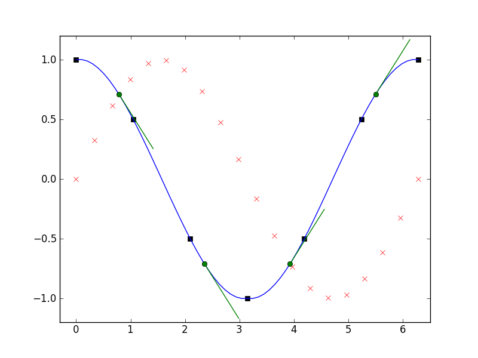

===================
Tutorial: 1D Meshes
===================

.. toctree::
   :maxdepth: 2
  
A typical mesh is made up of nodes and elements.

Currently there are two types of nodes that can be added to a mesh:

# standard nodes for field values
# dependent nodes for values that depend on a location on an element 

---------------
Building a Mesh
---------------
Here we create a mesh to describe a sine wave. The mesh is composed of
two quadratic lines (1D elements). First we generate five points along
the sine wave and add them as nodes,

.. literalinclude:: ../examples/tutorial1.py
    :start-after: # sphinx tag generate 0
    :end-before: # sphinx tag generate 1

Using the nodes we create two quadratic lagrange elements elements
('L2'). 

.. literalinclude:: ../examples/tutorial1.py
    :start-after: # sphinx tag generate 2
    :end-before: # sphinx tag generate 3

And that's it, you have a mesh you can analyse. Let's calculate the
coordinates and first derivative of some interpolated points along
element 1,

.. literalinclude:: ../examples/tutorial1.py
    :start-after: # sphinx tag generate 4
    :end-before: # sphinx tag generate 5

Note, the derivatives with respect to the material coordinates (element
coordinate system, s), i.e., dx/ds and dy/ds,

--------
Plotting
--------

The red crosses is the data, black squares the nodes, blue line the
element lines, green circles the interpolated coordinates, and green
lines the interpolated derivatives.

There are convinient functions to allow you interrogate the mesh for
analysis or plotting:

For plotting the data,

.. literalinclude:: ../examples/tutorial1.py
    :start-after: # sphinx tag plotting 1
    :end-before: # sphinx tag plotting 2

For plotting the nodes,

.. literalinclude:: ../examples/tutorial1.py
    :start-after: # sphinx tag plotting 3
    :end-before: # sphinx tag plotting 4

For plotting the element lines,

.. literalinclude:: ../examples/tutorial1.py
    :start-after: # sphinx tag plotting 5
    :end-before: # sphinx tag plotting 6

The ``res=32`` parameter specifies the number of divisions along each element.

For plotting the interpolated coordinates and derivatives,

.. literalinclude:: ../examples/tutorial1.py
    :start-after: # sphinx tag plotting 7
    :end-before: # sphinx tag plotting 8

Notice, you can enter a list of element ids to interpolate multiple
elements. The ``deriv=[1]`` parameter indicates the first-derivative.

-------
Fitting
-------

