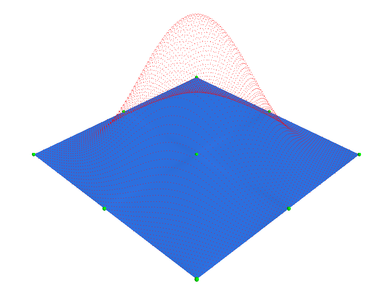
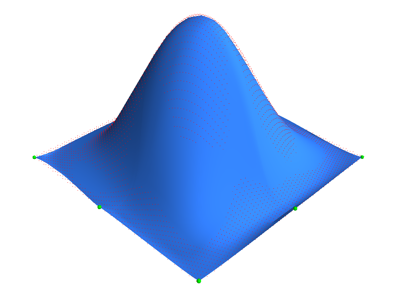
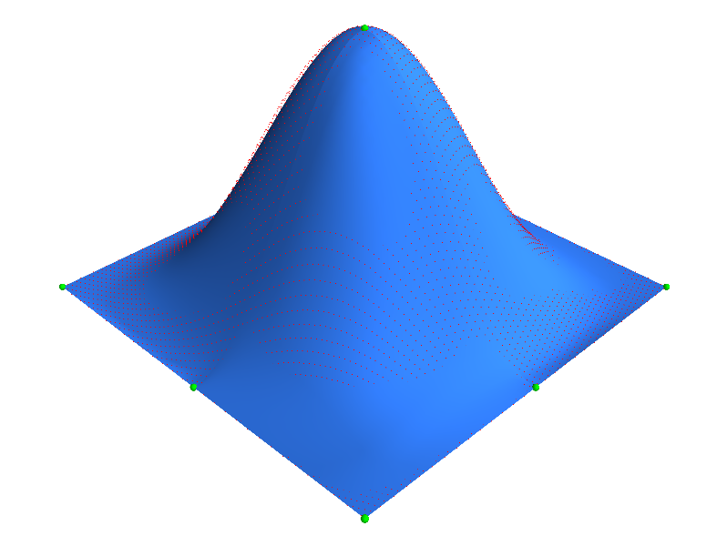

************************************************
Tutorial: Creating 2D Meshes and Fitting to Data
************************************************

.. toctree::
   :maxdepth: 2
  

In this tutorial we build a 2D mesh using cubic-Hermite elements and fit
the mesh to data generated using a cosine function.

For this tutorial we'll need to import ``scipy`` and ``morphic``.

.. literalinclude:: ../examples/example_2d_fit_lse.py
    :start-after: # sphinx tag start import
    :end-before: # sphinx tag end import

===============
Building a Mesh
===============
First, we create some node point which will be arranged in a regular 3x3
grid ranging from ``x = [-pi, pi]`` and ``y = [-pi, pi]``. The z values
are set to zero.

.. literalinclude:: ../examples/example_2d_fit_lse.py
    :start-after: # sphinx tag start generate node values
    :end-before: # Default derivatives values for cubic-Hermite nodes

Because we are using cubic-Hermite element, the nodal values require
derivative values which we default to,

.. literalinclude:: ../examples/example_2d_fit_lse.py
    :start-after: # Default derivatives values for cubic-Hermite nodes
    :end-before: # sphinx tag end generate node values

Now, we create the mesh,

.. literalinclude:: ../examples/example_2d_fit_lse.py
    :start-after: # Create mesh
    :end-before: # Add nodes

We add the nodes where for each node value we append the derivative
values,

.. literalinclude:: ../examples/example_2d_fit_lse.py
    :start-after: # Add nodes
    :end-before: # Add elements

Now we add four bicubic-Hermite elements, which are ``['H3', 'H3']``
basis,

.. literalinclude:: ../examples/example_2d_fit_lse.py
    :start-after: # Add elements
    :end-before: # Generate the mesh
    
And finally generate the mesh structures,

.. literalinclude:: ../examples/example_2d_fit_lse.py
    :start-after: # Generate the mesh
    :end-before: # sphinx tag end generate mesh

=============
Generate Data
=============
The data cloud is based on a cosine function, ``z = cos(x + 1) cos(y + 1)``.
A 200 x 200 grid of points are created in the x and y dimensions on which
the z values are generated. The ``res=24`` parameter sets the
discretization of the elements. The higher the value the smoother the
rendered surface.

.. literalinclude:: ../examples/example_2d_fit_lse.py
    :start-after: # Generate a data cloud for fitting
    :end-before: # sphinx tag end generate data

========
Plotting
========

Here we want to view our initial mesh and data. First we need to extract
the coordinates of the nodes (without derivatives) and a surface of the
mesh, which is done using the following commands,

.. literalinclude:: ../examples/example_2d_fit_lse.py
    :start-after: # sphinx start get node values and surface
    :end-before: # sphinx end get node values and surface

Next we want to plot the mesh nodes and surface and the data which is
done using the ``morphic.viewer`` module,

.. code-block:: python
    
    from morphic import viewer
    S = viewer.Scenes('MyPlot', bgcolor=(1,1,1))
    S.plot_points('nodes', Xn, color=(0,1,0), size=0.1)
    S.plot_surfaces('surface', Xs, Ts, color=(0.2,0.5,1))
    S.plot_points('data', Xd[::7,:], color=(1,0,0), mode='point')

The resultant plot is shown where the nodes are plotted in green, the
mesh surface in blue and the data in red,
 

=======
Fitting
=======

In this section we describe how to fit the mesh to the datacloud. Here
we use the fitting method that generates and solves a linear system of
equations, i.e., ``A.x = b``, where ``A`` is the matrix of weights for
points on the mesh, ``x`` are the mesh parameters, and ``b`` are the 
data point that the mesh points are fitted to. See **TODO: add link**

There are two demonstrations of the fitting process, first we fit
without constraining mesh node parameters and second we fit with
constraints on the node values and derivatives.

--------------------------
Fit Part 1: No Constraints
--------------------------

Ok, let's get started. First we create a new fitting instance:

.. literalinclude:: ../examples/example_2d_fit_lse.py
    :start-after: # Generate a fit
    :end-before: # Add a grid of 10x10 points on each element

Then we add element points on the mesh to the fitting process. This is a
10x10 grid of points on each element. These are the points that will be
projected to the datacloud.

.. literalinclude:: ../examples/example_2d_fit_lse.py
    :start-after: # Add a grid of 10x10 points on each element
    :end-before: # Update and generate the fit data structures using the mesh

Then we generate the fit from the mesh. Here the fitting module will
calculate the weights for each grid point on the mesh and assemble these
in the A matrix for the ``A.x = b`` system.

.. literalinclude:: ../examples/example_2d_fit_lse.py
    :start-after: # Update and generate the fit data structures using the mesh.
    :end-before: # Add data to fit

We add the data cloud to the fitting process and call a function called
``generate_fast_data`` which creates a kd-tree of the data for fast
searching of the closest data points.

.. literalinclude:: ../examples/example_2d_fit_lse.py
    :start-after: # Add data to fit
    :end-before: # Invert and fit the mesh to the data

Now we invert the A matrix in order to speed up the fitting process and
if the mesh to the datacloud. Currently we run the fit for a 100 iterations
where each iteration involves finding the closest data points for the
current mesh and then fitting the mesh to the closest data points.

.. literalinclude:: ../examples/example_2d_fit_lse.py
    :start-after: # Invert and fit the mesh to the data
    :end-before: # Plot fit part 1

The plot of the resultant fit shows a fairly good fit except the 
boundaries are not straight and also we expect the middle node to be at
the peak of the data cloud. This can be achieved in the fit by
constraining the appropriate node parameters. This is described in the
next section.

----------------------------
Fit Part 2: With Constraints
----------------------------

In this section we are going to constrain appropriate node values and 
derivatives to get straight boundaries and a more symmetric mesh. We
define constrains on nodes values using the following command:

.. code-block:: python
    
    fit.bind_node_value(node_id, field_num, component_num, data_label, weight=weight)

where the ``weight`` defines the weighting of the constraint. The default
is 1, which is what the binding for the element points is set to. The
higher this number the closer the resultant fit will met its constraint.

.. warning::
    
    Setting the ``weight`` very high compared to the minimum weight in the fit
    can cause fitting issues.

.. note::
    
    The indexing of the ``field_num`` and ``component_num`` starts at zero.

Just like how we added the data cloud, the data values we would like to
constrain the node parameters to are defined using a data label. First we
define an array of data labels indicating which how each node is
constrained. The rows in the array represent the node and the columns
represent x, y and z values. This allows a easy programatic way of setting
the constraints. First, the node values are constrained, then the derivatives.

.. literalinclude:: ../examples/example_2d_fit_lse.py
    :start-after: # Fix node values [x, y, z, dz/dxi1, dz/dxi2]
    :end-before: # Add data to fit part 2

In the final line, we regenerate the fit from the mesh after we define the node
value constraints.

Next, as above, we add the data values we constrain the node values to
and regenerate the fast data. In this case, no kd-tree is created since
there is only one value per data label.

.. literalinclude:: ../examples/example_2d_fit_lse.py
    :start-after: # Add data to fit part 2
    :end-before: # Fit part 2

And again we invert the matrix and solve the fit,

.. literalinclude:: ../examples/example_2d_fit_lse.py
    :start-after: # Fit part 2
    :end-before: # Plottin' part 2

As shown in the resultant plot, the fit produces straigher boundaries and
a symmetric mesh, i.e., the nodes are laid out in a regular fashion.

