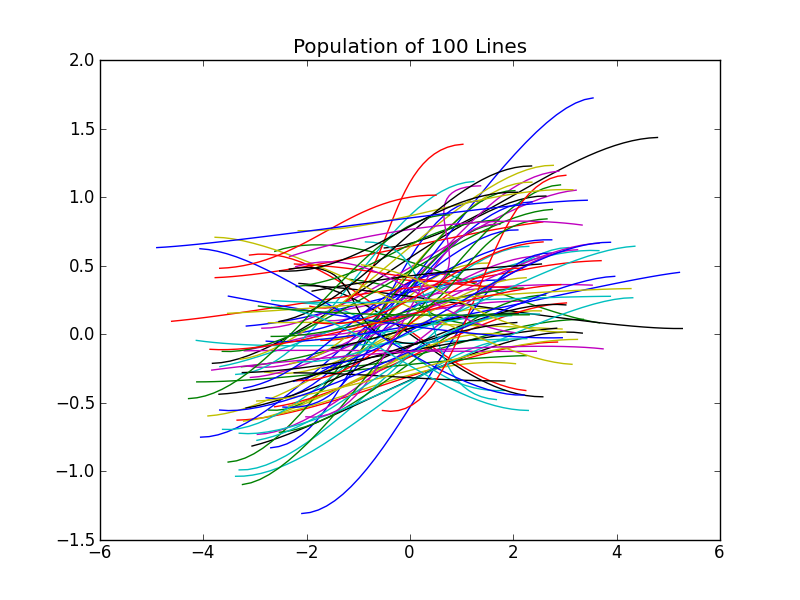
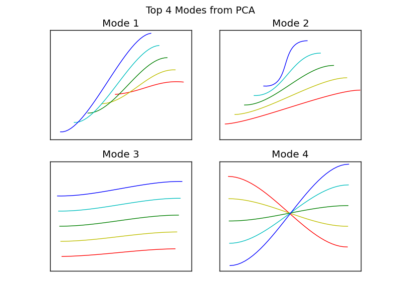

********************
Tutorial: PCA Meshes
********************

.. toctree::
   :maxdepth: 2
  

In this tutorial we build a 1D cubic-Hermite PCA mesh. The population of
meshes used to create the PCA mesh is generated by modifying some nodal
parameters using a Gaussian ditribution. The output from PCA of this
population of meshes are used to create the PCA mesh.

For this tutorial we'll need to import ``scipy``, ``random``, ``pylab``,
``mdp`` and, ofcourse, ``morphic``.

===================================
Creating a Population of 100 Meshes
===================================

First, we create simple 1D cubic-Hermite mesh with two nodes and
one element.

.. literalinclude:: ../examples/tutorial_1d_pca_mesh.py
    :start-after: # GENERATE POPULATION OF MESHES
    :end-before: # Now we can randomise the mesh
    
Then we create a function to randomise six the mesh parameters:

.. literalinclude:: ../examples/tutorial_1d_pca_mesh.py
    :start-after: # Mesh randomiser
    :end-before: # GENERATE POPULATION OF MESHES

An example of running this function a 100 times and plotting the results
is shown in the figure below.

==============
Performing PCA
==============

Although PCA can be performed an any data, it is not good practice to
perform PCA data with mixed units, which in our case is a cubic-Hermite
mesh that has position and derivative values. To overcome this issue we
will convert the cubic-Hermite mesh to a cubic-langrange mesh, which will
preserve all information.

To perform PCA, we convert all our meshes to cubic-lagrange by evaluating
the field values at ``Xi`` 0, 1/3, 2/3, and 1. These values are stored in
a large array for PCA.

.. literalinclude:: ../examples/tutorial_1d_pca_mesh.py
    :start-after: # Create a population of meshes
    :end-before: # and plot if need be

Then we use MDP to perform PCA and print out the average mesh, mode values,
and variance for each mode,

.. literalinclude:: ../examples/tutorial_1d_pca_mesh.py
    :start-after: # PERFORM PCA
    :end-before: # tag end pca

Now we can create a mesh that uses the PCA results.

===================
Creating a PCA Mesh
===================

Morphic has a node class to manage PCA values as nodes. It knows how to
evaluate the vlaues of the node given a set of weights.

There are 5 steps to creating a PCA mesh:
    
    1. add the PCA weights as a standard node
    2. add the PCA variance as a standard node
    3. add the PCA modes for each node as a standard node
    4. add the PCA nodes which references the PCA modes, weights and variance nodes
    5. add the elements which references the PCA nodes

For example,

.. code-block:: python
    
    pcamesh = morphic.Mesh()
    
    pcamesh.add_stdnode('weights', [1, 0, 0, 0]) # Step 1: weights node
    
    pcamesh.add_stdnode('variance', [1, 0.5, 0.2, 0.1]) # Step 2: variance node
    
    # Step 3: add the mode values for each node
    pcamesh.add_stdnode('pca1', xm1)
    pcamesh.add_stdnode('pca2', xm2)
    pcamesh.add_stdnode('pca3', xm3)
    
    # Step 4: add the pca node for each node
    pcamesh.add_pcanode(1, 'pca1', 'weights', 'variance')
    pcamesh.add_pcanode(2, 'pca2', 'weights', 'variance')
    pcamesh.add_pcanode(3, 'pca3', 'weights', 'variance')
    
    # Step 5: add elements...
    pcamesh.add_element(1, ['L2'], [1, 2, 3])
    
    pcamesh.generate()

:note::
    The first value of the weights and variance nodes should be set to 1
    since it it multiplied with the mean values from the PCA.

For our case, we will initialise some values and create a new mesh
called ``pcamesh`` which will store and evaluate the PCA values,

.. literalinclude:: ../examples/tutorial_1d_pca_mesh.py
    :start-after: # GENERATE PCA MESH
    :end-before: # Initialise the weights

Now we add the weights values

.. literalinclude:: ../examples/tutorial_1d_pca_mesh.py
    :start-after: # Initialise the weights
    :end-before: # Initialise the variance.

And the variance values which are square rooted so that the weights can
be defined in terms of standard deviations,

.. literalinclude:: ../examples/tutorial_1d_pca_mesh.py
    :start-after: # can be defined as standard deviations
    :end-before: # Add the four cubic-Lagrange nodes

The mode values are added as standard nodes which are referenced by the
the PCA nodes,

.. literalinclude:: ../examples/tutorial_1d_pca_mesh.py
    :start-after: # Add the four cubic-Lagrange nodes
    :end-before: # Add element

Finally we add the element and generate the mesh,

.. literalinclude:: ../examples/tutorial_1d_pca_mesh.py
    :start-after: # Add element
    :end-before: # PCA modes element

We can now modify the values of the weights and analyse or plot the mesh.
Whenever the weights are change the mesh must be updated to recalculate
the PCA node values. For example,

.. code-block:: python
    
    pcamesh.nodes['weights'].values[2] = 1.3
    pcamesh.update_pca_nodes()

To show the outputs of the PCA mesh, we plot the top 4 modes of the mesh
for weights of -2, -1, 0, 1, and 2.

The python function used to plot these modes are below,

.. literalinclude:: ../examples/tutorial_1d_pca_mesh.py
    :start-after: # Plot each mode into a subplot
    :end-before: # end plot loop

